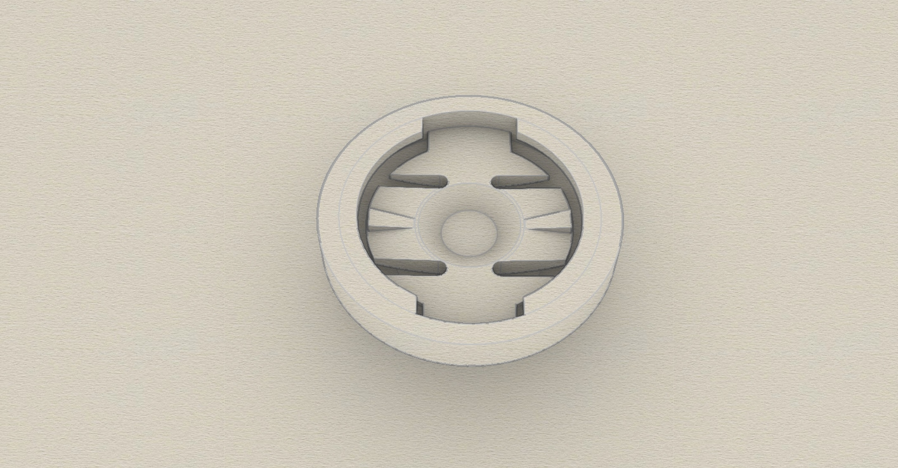
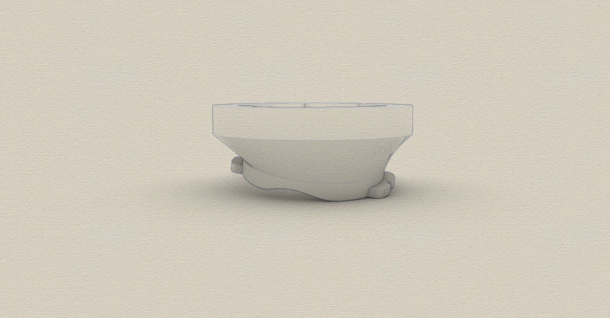
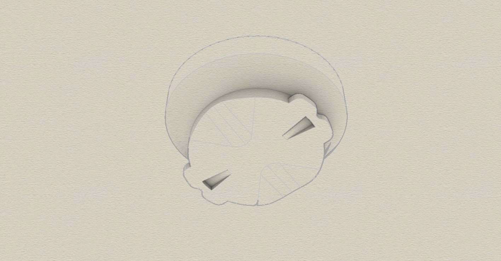
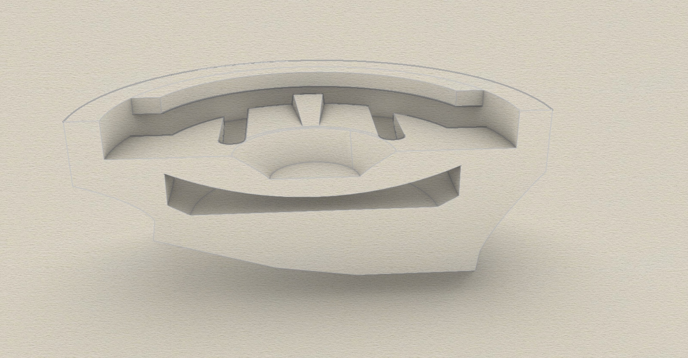
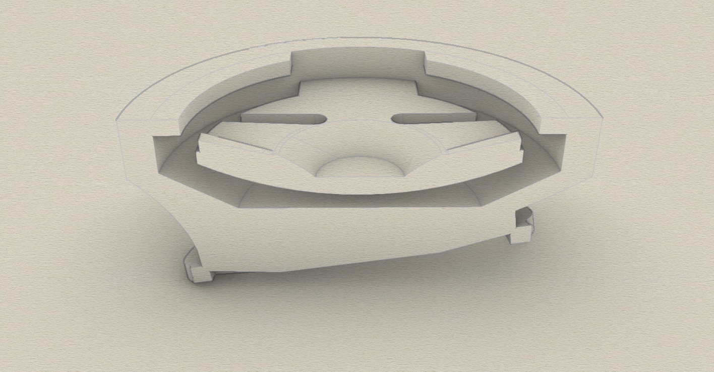
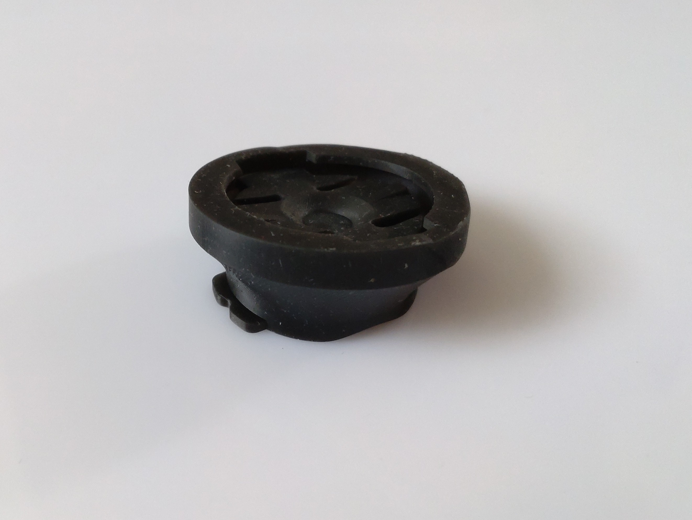
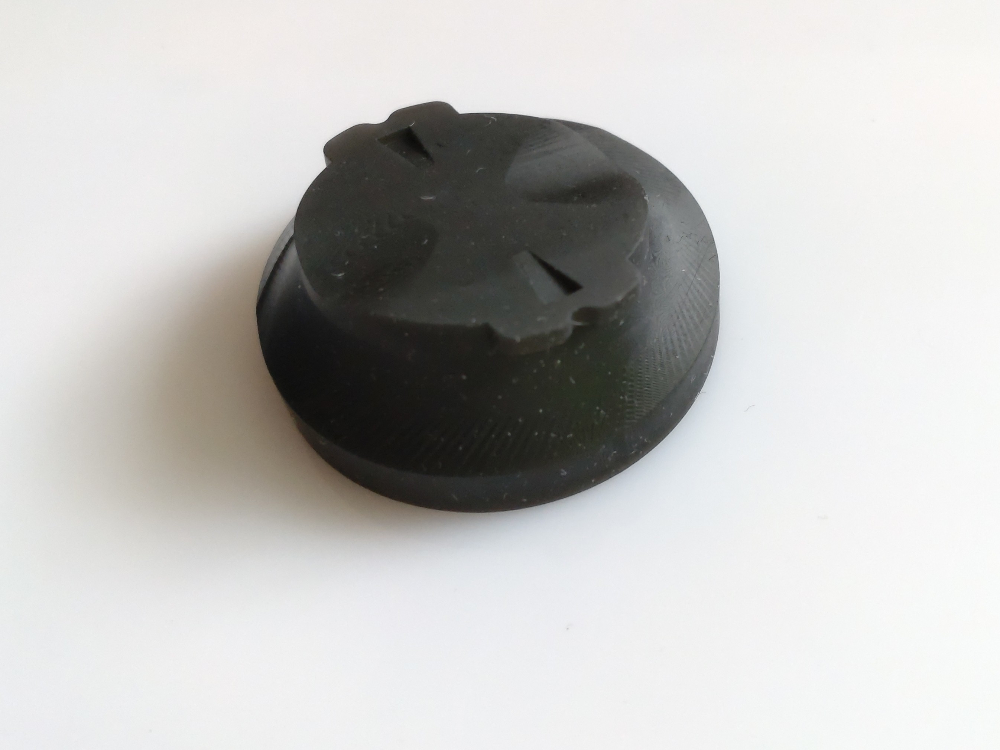
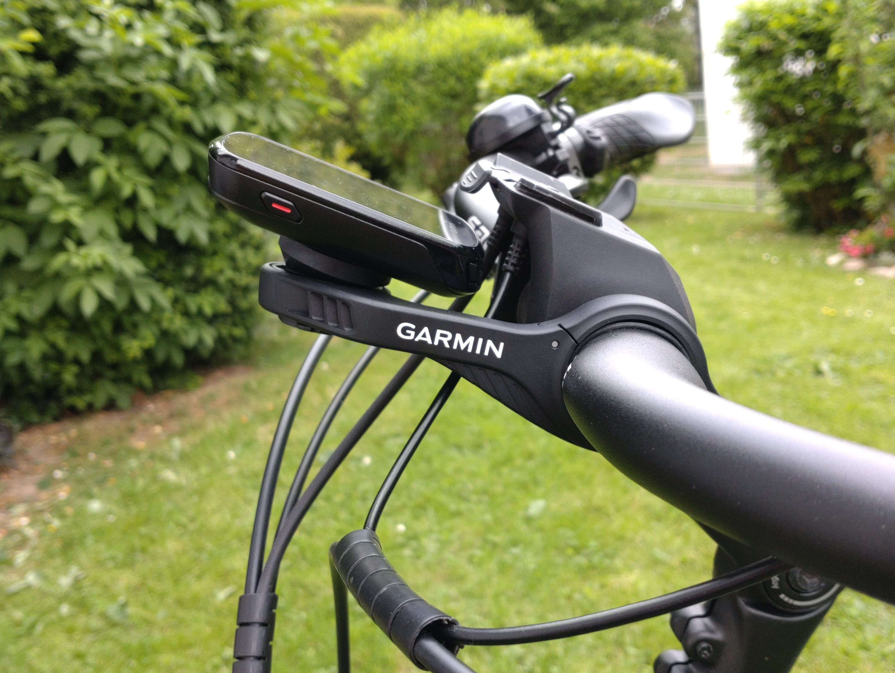
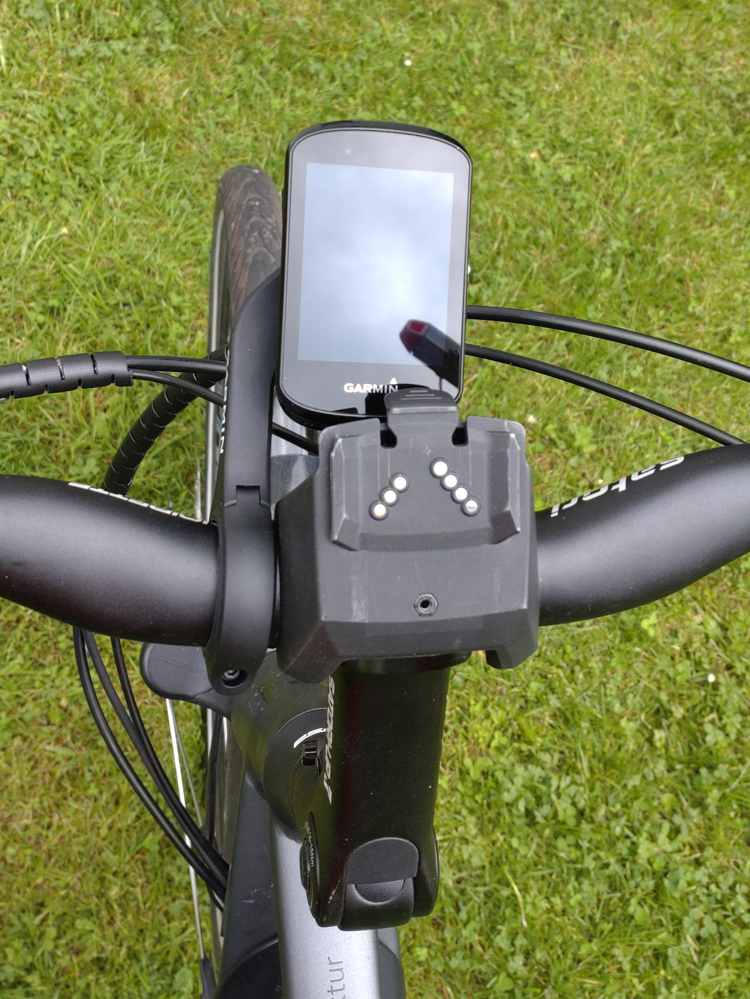

# Garmin-Edge-830-Adapter
Adapter to compensate for the inclination of a bicycle handlebar on the Garmin bracket (Created with Rhino 7).

# Adapter
3D printable Adapter for Garmin Edge 830 to compensate the inclination of a bicycle handlebar when mounting a Garmin bracket on it.

I recently bought the Garmin Edge 830 and used the original bracket which i mounted near the middle of the handlebar. Because of the inclination of the handlebar, the display view angle of the Garmin Edge is a bit uncomfortable.

For that reason i made this adapter which fits perfectly on both pieces, the Garmin Edge 830 abd the original Garmin bracket. You hear a soft click when placing the parts together. 

Requirements:
* 3D MSLA resin-printer 
* ABS-like Resin ( i mixed it with Flex Resin, 1 part Flex Resin to 6 Parts ABS-like Resin)

## View
 

